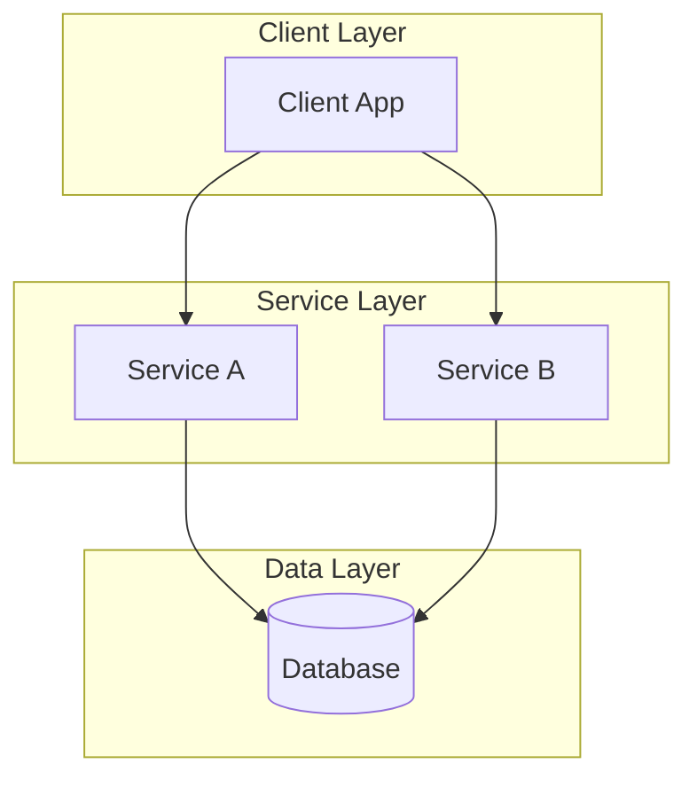
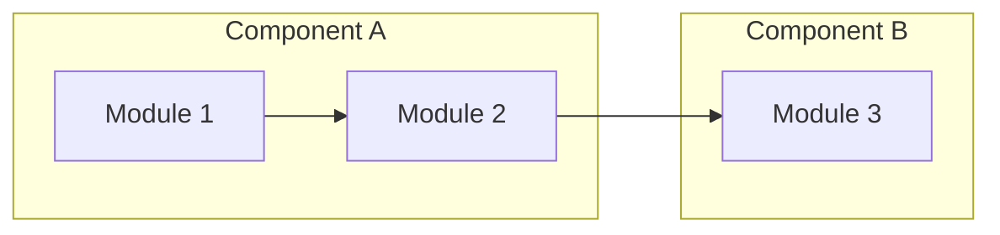
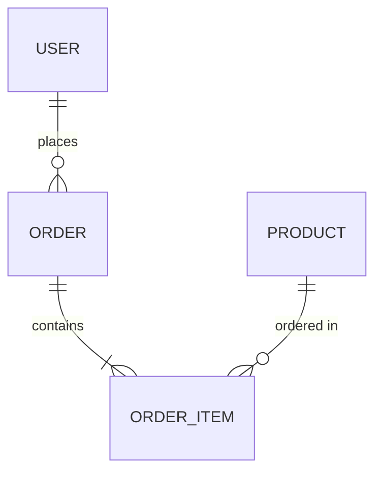

# [Feature Name] Engineering Design Document

| :--- | :--- |
| **Last Updated** | [YYYY-MM-DD] |
| **PRD Reference** | [Link to PRD or section] |

## Overview

*Briefly describe the problem this design aims to solve and its primary goals.*

## System Architecture

### High-Level Architecture



*Explain the reasoning behind the architectural choices.*

### Component Diagram



## Design Decisions

*Document key architectural decisions and their rationale. Focus on "why" rather than "what".*

### [Decision Title]

**Decision**: [What was decided]

**Rationale**: [Why this approach was chosen]

**Alternatives Considered**: [Other options evaluated and why they were not selected]

## Components

### [Component Name]

**Responsibilities**:
- Responsibility 1
- Responsibility 2

**Key Interfaces**:

*Define the contract, not the implementation. SDE decides how to implement.*

```go
type Service interface {
    Method(ctx context.Context, input Input) (Output, error)
}
```

**Design Considerations**:
*Explain the design rationale and any trade-offs made.*

## Data Model

### Entity Relationship Diagram



### Schema Definition

| Table | Column | Type | Constraints | Description |
|-------|--------|------|-------------|-------------|
| users | id | UUID | PRIMARY KEY | Unique identifier |
| users | email | VARCHAR(255) | UNIQUE, NOT NULL | User's login email |
| users | created_at | TIMESTAMP | DEFAULT NOW() | Record creation time |

## API Design

### Endpoints

| Method | Path | Description |
|--------|------|-------------|
| POST | /api/v1/resource | Create resource |
| GET | /api/v1/resource/:id | Get resource by ID |

### Request/Response Examples

**POST /api/v1/resource**

Request:
```json
{
  "field": "value"
}
```

Response:
```json
{
  "id": "uuid",
  "field": "value",
  "created_at": "2024-01-01T00:00:00Z"
}
```

## Frontend Design

### Pages

| Page | Description | Key Interactions |
|------|-------------|------------------|
| Home | Landing page with feature overview | Link to login/signup |
| Dashboard | User main workspace | CRUD operations on resources |

### Technology & Communication

- **Framework/Library**: [e.g., Alpine.js, React, Vue]
- **Styling**: [e.g., Tailwind CSS, Vanilla CSS]
- **State Management**: [e.g., Store, Local State]
- **API Communication**: [e.g., Fetch API, Axios]

## Directory Structure

```
project/
├── cmd/
│   └── server/
│       └── main.go          # Application entry point
├── internal/
│   ├── domain/              # Domain models and business logic
│   │   ├── entity.go
│   │   └── repository.go    # Repository interfaces
│   ├── usecase/             # Application use cases
│   │   └── service.go
│   └── infra/               # Infrastructure implementations
│       ├── repository/
│       └── handler/
├── web/                     # Frontend resources
│   ├── internal/            # Frontend logic (e.g., TS/JS files)
│   ├── templates/           # HTML templates
│   └── static/              # Static assets (CSS, JS, Images)
├── pkg/                     # Shared utilities
└── docs/
    ├── prd.md
    └── edd.md
```

## Technology Stack

| Category | Technology | Notes |
|----------|------------|-------|
| Language | Go / Python / Rust | Primary development language |
| Database | PostgreSQL / MySQL | Main data store |
| Cache | Redis | Session and data caching |
| Message Queue | Kafka / RabbitMQ | Async communication |

## Assumptions and Constraints

### Assumptions
- Assumption 1
- Assumption 2

### Constraints
- Constraint 1
- Constraint 2

## Security Considerations

- Authentication: [Method]
- Authorization: [Policy]
- Data protection: [Measures]

## Non-Functional Requirements

| Requirement | Target | Measurement |
|-------------|--------|-------------|
| Latency | p99 < 100ms | Load testing |
| Throughput | 1000 RPS | Load testing |
| Availability | 99.9% | Monitoring |

## Open Questions

- [ ] Question 1
- [ ] Question 2

## References

- [Link to relevant documentation]
- [Link to related design documents]
