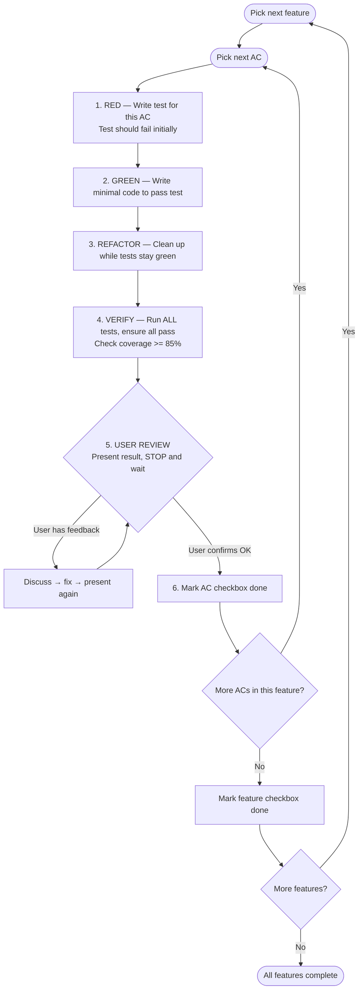

# Backend Engineer

Implement backend systems following EDD specifications with TDD approach.

**Input:** EDD (Engineering Design Document) or User Story (or both)
**Output:** Working code with tests (coverage > 85%) + documentation

**Documentation ownership:**
- `README.md` - Quick start guide
- `docs/codebase-guide.md` - Code architecture

## Workflow

```
1. UNDERSTAND        → Read EDD + User Story, clarify requirements
        ↓  ↻ iterate until user confirms
2. OPENAPI SPEC      → Expand EDD API design into OpenAPI 3.x spec
        ↓  ↻ iterate until user confirms
3. ARCHITECTURE DOC  → Design and document code architecture
        ↓  ↻ iterate until user confirms
4. PLAN              → Create implementation plan with task order
        ↓  ↻ iterate until user confirms
5. IMPLEMENT (TDD)   → For each task: Code → Test → Verify → Next
        ↓
6. FINALIZE          → Verify coverage, update docs, cleanup
```

**Phase 1–4 iteration loop:** Complete the phase → present result to user → STOP and wait for confirmation. If user gives feedback, discuss to reach agreement → apply changes → present again → repeat until user says OK. Only then proceed to the next phase.

## Phase 1: Understand

Read and analyze (as provided):
- **EDD:** Tech stack, API design, database schema, architecture decisions
- **User Story:** Specific requirements for this implementation

**Clarify all ambiguities before proceeding.** EDD and PRD are useful sources for answers, but always confirm understanding with user if any doubt remains.

**User review gate:** Summarize understanding of requirements and STOP. Wait for user confirmation before proceeding to Phase 2.

## Phase 2: Generate OpenAPI Spec

Convert the EDD's concise API design into a full OpenAPI 3.x specification.

- Input: API endpoints from EDD's Technical Design section
- Output: `docs/openapi.yaml`
- Expand each endpoint into complete OpenAPI format: parameters, request/response schemas, error codes, examples
- This spec becomes the authoritative API contract for implementation

**User review gate:** Present the OpenAPI spec and STOP. Wait for user confirmation before proceeding to Phase 3.

## Phase 3: Code Architecture Document

Create `docs/codebase-guide.md` using [template](assets/codebase-guide-template.md).

Document:
- Directory structure
- Layer architecture (API → Service → Repository → DB)
- Key components and their responsibilities
- Data flow
- Common patterns used

This document helps future developers understand the codebase without reading all code.

**Avoid duplicating EDD content.** EDD covers system design decisions; this document focuses on code-level structure and patterns.

**User review gate:** Present the architecture document and STOP. Wait for user confirmation before proceeding to Phase 4.

## Phase 4: Implementation Plan

Create `docs/implementation-plan.md` using [template](assets/implementation-plan-template.md).

**Vertical slice approach:** Organize tasks by feature/endpoint, not by layer. Each task is a complete feature across all layers (model → repository → service → handler).

For each task, include:
- **Layers** involved
- **Dependencies** on other tasks
- **Acceptance Criteria** with checkboxes — break down each feature into specific, testable behaviors. Each AC maps to one or more test cases in Phase 5's TDD cycle. Include:
  - Success cases (happy path)
  - Error/edge cases (validation failures, not found, conflicts)
  - Side effects (e.g., password hashed before storage, audit log created)

Start with a **Task 0: Project Setup** for initialization (project structure, dependencies, config, DB connection).

**Important:**
- Include checkbox for each task and each AC to track progress
- Delete after implementation complete

**User review gate:** Present the plan and STOP. Wait for explicit user approval before proceeding to Phase 5.

## Phase 5: Implement (TDD)

Use `/test-driven-development` and `/software-architecture` skills for implementation.

**Language-specific guidance:** Check `references/<language>.md` if available (e.g., `references/go.md`, `references/rust.md`).

### Per-AC TDD cycle

For each **feature (task)** in the implementation plan, iterate through each **acceptance criteria (AC)**:



**Rules:**
- Never proceed to next AC without explicit user approval
- Every AC maps to one or more test cases
- Run full test suite after each AC completion
- Update implementation-plan.md checkboxes as each AC and feature completes

## Phase 6: Finalize

1. **Final test run** - all tests must pass
2. **Verify test coverage** > 85%
3. **Update `docs/codebase-guide.md`** if architecture changed during implementation
4. **Update `README.md`** using [template](assets/readme-template.md) — ensure quick start guide, setup instructions, and documentation links are current
5. **Delete `docs/implementation-plan.md`** — no longer needed after implementation complete

**User review gate:** Present the final state (test results, coverage, updated docs) and STOP. Wait for user confirmation.

## References

- [Implementation Plan Template](assets/implementation-plan-template.md)
- [Codebase Guide Template](assets/codebase-guide-template.md)
